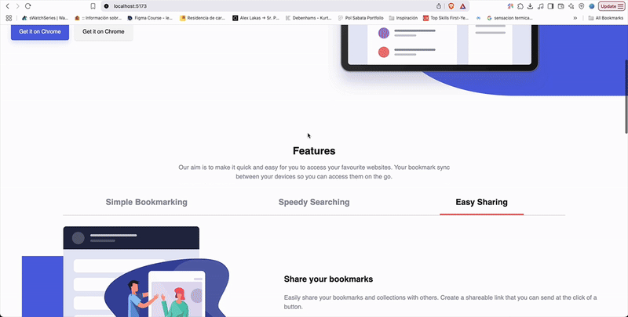

# React Landing Page – S5 Exercise

This project is a first exercise using **React** to rebuild the landing page from **S1 Vanilla HTML/CSS/JS** using a component-based architecture and atomic design principles.

## 🖼 Demo



---

## 🎯 Objectives

- ✅ Recreate the S1 landing page using **React + TypeScript**
- ✅ Learn the **basics of React**, including:
  - JSX and Components
  - `useState` hook
  - Props and composition
- ✅ Apply **Atomic Design** principles to organize and scale components

---

## 🔄 Workflow

1. **Start from the S1 Vanilla project**
2. **Break down global HTML/CSS into reusable pieces**
3. **Convert each section into a React component**
4. **Structure the project by Atomic Design levels**
5. **Iteratively add components to the `develop` branch**
6. **Refactor and connect everything in `App.tsx`**

---

## 📁 Project Structure

```
src/
├── assets/                # Static files (images, etc.)
├── components/            # All UI components, grouped by sections
│   ├── 00-shared/         # Reusable atoms across sections.
│   ├── 01-Navbar/         
│   ├── 02-MobileMenu/    
│   ├── 03-Hero/           
│   ├── 04-Features/      
│   ├── 05-Download/       
│   ├── 06-FAQ/            
│   ├── 07-CTA/            
│   └── 08-Footer/         
├── styles/                # Global styles
├── App.tsx                # Root component
├── main.tsx               # Entry point
```

---

## 🛠️ Tech Stack

- **React 19**
- **TypeScript**
- **Vite** for fast dev environment
- **ESLint** for linting
- **Atomic Design** structure

---

## 📦 Installation

```bash
# 1. Clone the repo
git clone https://github.com/angelesgonzalez/S5-React.git
cd s5-React

# 2. Install dependencies
npm install

# 3. Run the dev server
npm run dev
```

---

## 🧠 What I Learned

 • How to break a page into reusable React components  
 • Managing state using useState  
 • Passing data via props  
 • Organizing a project using Atomic Design  
 • Setting up a React project using Vite and TypeScript
